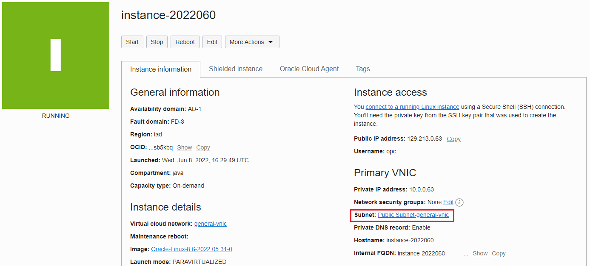
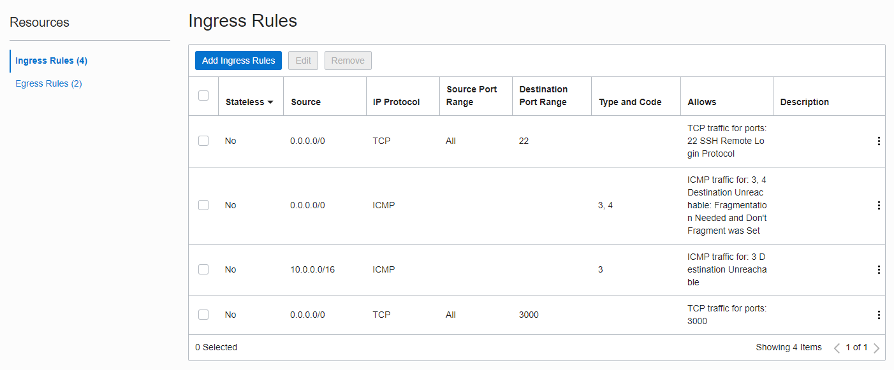
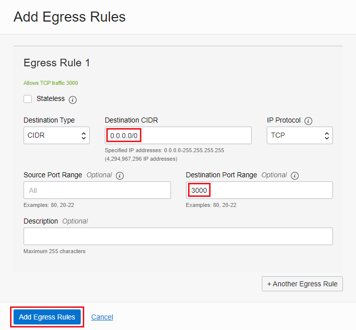
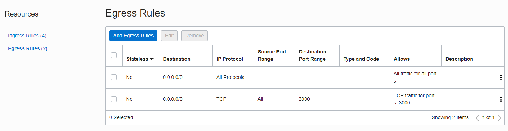
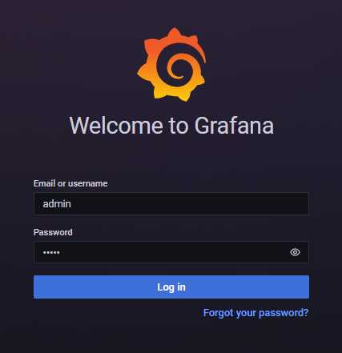
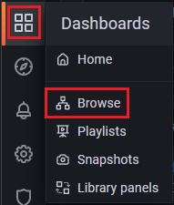
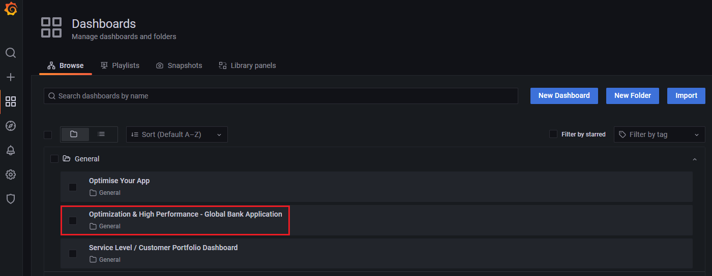

# Java Performance Comparison Dashboard Demo

The goal of this demo is to compare performance of Java applications running in a virtual environment or deployed in containers.  

#### Prerequisites

The following demonstration requires OpenJDK (17), GraalVM (17) and the native image module.  You'll also need to install Maven, git, docker and [docker-compose](https://www.isscloud.io/guides/install-docker-docker-compose-on-oracle-linux-8/). See instructions below.

#### Create an OCI instance

Recommendation is for **6-cores** and **64GB** of memory.

Download or add your `ssh` keys.

Change permissions of the `ssh` keys (`600` for private/`644` for public).

Login to your OCI Instance:
```
ssh -i <private-ssh-key> opc@<instance-ip-address>
```

#### Instance Setup and Configuration

Update the instance:
```
sudo dnf update -y
```

Install Development Tools
```
sudo dnf group install "Development Tools"
```

Install SDKMAN (Optional)
```
curl -s "https://get.sdkman.io" | bash
source "$HOME/.sdkman/bin/sdkman-init.sh"
```

Install Supporting Tools Using SDKMAN (Optional)
```
sdk install java 17.0.3-oracle
sdk install maven
```
> NOTE: If you choose not to use SDKMAN, you'll need to install Maven manually.

Install GraalVM and Native Image Module
```
sudo dnf install graalvm22-ee-17-jdk -y
sdk install java 22.1.0.1-17-ee /usr/lib64/graalvm/graalvm22-ee-java17 <-- Uses SDKMAN, alternatively, set JAVA_HOME
sdk use java 22.1.0.1-17-ee <-- Uses SDKMAN, alternatively, set JAVA_HOME
java -version
```

```
sudo dnf update -y oraclelinux-release-el8
sudo dnf config-manager --set-enabled ol8_codeready_builder
sudo dnf install graalvm22-ee-17-native-image -y
native-image --version
```

Install Container Support
```
sudo dnf config-manager --add-repo=https://download.docker.com/linux/centos/docker-ce.repo
sudo dnf install docker-engine docker-cli -y
sudo systemctl enable docker.service
sudo systemctl start docker.service
sudo systemctl status docker.service
sudo usermod -aG docker $USER
newgrp docker
```

Install `docker-compose`
```
curl -L https://github.com/docker/compose/releases/download/v2.5.0/docker-compose-linux-x86_64 -o /usr/local/bin/docker-compose
chmod +x /usr/local/bin/docker-compose
```

#### OCI Ingress/Egress Configuration

Under the instance details, click on the **Public Subnet** link: 



Then click on the **Default Security** List link:


Add an **Ingress Rule** for Grafana access by clicking on the **Add Ingress Rules** button:




Now add an **Egress Rule** for Grafana access by clicking on the **Add Egress Rules**:






### Starting the Demo Environment

If the repository hasn't already been cloned, you can access it here:

```
$ git clone https://github.com/swseighman/Java-Perf-Grafana.git
```

It's recommended you login to [container-registry.oracle.com](container-registry.oracle.com) using your Oracle credentials before executing the `build.sh` script:

```
docker login container-registry.oracle.com
```


#### Build the Project
```
sdk use java 22.1.0.1-17-ee  <-- SDKMAN command or set JAVA_HOME
cd Java-Perf-Grafana/demo
./build.sh
```

At the conclusion of a successful build, you should have the following containers in place:

```
$ docker images
REPOSITORY                                         TAG              IMAGE ID       CREATED              SIZE
localhost/primes                                   nativeopt.0.1    5fa76f1052e0   12 seconds ago       182MB
localhost/primes                                   nativeinst.0.1   8f3944db959d   28 seconds ago       383MB
localhost/primes                                   nativeg1.0.1     f36c934b6462   53 seconds ago       197MB
localhost/primes                                   native.0.1       1cba049158c1   About a minute ago   177MB
localhost/primes                                   graalee.0.1      b96aba6e3561   About a minute ago   1.59GB
localhost/primes                                   openjdk.0.1      c5602aac5429   2 minutes ago        945MB
container-registry.oracle.com/os/oraclelinux       8                3bbe8a2c4b82   7 days ago           226MB
container-registry.oracle.com/os/oraclelinux       8-slim           1fcc1e6dda05   3 weeks ago          101MB
container-registry.oracle.com/graalvm/enterprise   latest           1f40c654b792   7 weeks ago          1.57GB
```

Start all of the containers/services:

```
docker-compose up
```

```
$ docker ps
CONTAINER ID   IMAGE                              COMMAND                  CREATED          STATUS                    PORTS                                       NAMES
14741933bfe2   ricoli/hey                         "/go/bin/hey -z 60m …"   23 minutes ago   Up 23 minutes                                                         demo-stress-graalee-1
252989061fb8   ricoli/hey                         "/go/bin/hey -z 60m …"   23 minutes ago   Up 23 minutes                                                         demo-stress-openjdk-1
2361ea7c1d11   ricoli/hey                         "/go/bin/hey -z 60m …"   23 minutes ago   Up 23 minutes                                                         demo-stress-native-opt-1
ffd0dae2aeb1   ricoli/hey                         "/go/bin/hey -z 60m …"   23 minutes ago   Up 23 minutes                                                         demo-stress-native-g1-1
d07f840d1baa   localhost/primes:nativeopt.0.1     "/prime"                 23 minutes ago   Up 23 minutes             0.0.0.0:8090->8080/tcp, :::8090->8080/tcp   primes-native-opt
9186bd3646d6   localhost/primes:nativeg1.0.1      "/prime"                 23 minutes ago   Up 23 minutes             0.0.0.0:8088->8080/tcp, :::8088->8080/tcp   primes-native-g1
a410193b3e0d   grafana/grafana-oss                "/run.sh"                23 minutes ago   Up 23 minutes             0.0.0.0:3000->3000/tcp, :::3000->3000/tcp   grafana
97beacba7d71   localhost/primes:graalee.0.1       "java -jar prime-0.0…"   23 minutes ago   Up 23 minutes             0.0.0.0:8086->8080/tcp, :::8086->8080/tcp   primes-graalee
9d2cfc1a98bb   localhost/primes:openjdk.0.1       "/root/.sdkman/candi…"   23 minutes ago   Up 23 minutes             0.0.0.0:8085->8080/tcp, :::8085->8080/tcp   primes-openjdk
ef61cf13fc28   localhost/primes:native.0.1        "/prime"                 23 minutes ago   Up 23 minutes             0.0.0.0:8087->8080/tcp, :::8087->8080/tcp   primes-native
45eb7e45d3ed   prom/prometheus                    "/bin/prometheus --c…"   23 minutes ago   Up 23 minutes             0.0.0.0:9090->9090/tcp, :::9090->9090/tcp   prometheus
48bfbc5b56c6   gcr.io/cadvisor/cadvisor:v0.42.0   "/usr/bin/cadvisor -…"   23 minutes ago   Up 23 minutes (healthy)   0.0.0.0:9099->8080/tcp, :::9099->8080/tcp   cadvisor
```

> **NOTE:** If you're using MacOS, the build of the images using G1GC (`nativeopt`, `nativeg1`, `native-inst`) will fail because G1 is only supported on Linux/x64. 
>
>In addition, while the native image build will succeed, the container will fail to start due to binary incompatibility.  Use the `build-macos.sh` script to build the native image containers then execute `docker-compose up`.

### Demo Apps

A simple `primes` demo has been provided but other applications can be added.

> **NOTE:** 
> The `primes` demo has been compiled using Java 17, make certain you're using Java 17.

The `primes` demo produces data via `spring-actuator` (see source code) and is consumed by Prometheus. The app runs on port **8080**. Once started, you should begin to see data in the Grafana dashboard.

### Running Benchmarks

To help generate real-time data, `hey` has been installed so that you can run benchmark tests. A script has been provided to start the benchmark tests: 

```
$ ./stress.sh
```

To stop all of the services execute:

```
$ docker-compose stop
```

### Accessing the Grafana Dashboard

To access the Grafana dashboard (with application data), browse to: http://*your-instance-ip*:3000/login



Credentials:

**Login:** admin

**Password:** admin

You can **Skip** changing the admin password:


Click on the **Dashboards** icon on the left of the Grafana interface and choose **Browse**:



Choose the **Optimization & High Performance** dashboard from the list:



You should see metrics on the dashboard.

The **Optimization and High Performance** dashboard displays a collection of metrics scraped from:

* Prometheus
* Node (system metrics)
* Cadvisor (containers)
* Spring-actuator (demo app)

This first graph represents memory utilization, the second reflects application startup time. The far-right graphs show the percentage improve of resources (memory) and startup time.

The OpenJDK graph on the left represents an optimized application while native image (on the right) represents the high-performant AOT application.

The last graph displays a comparison of application throughput.


