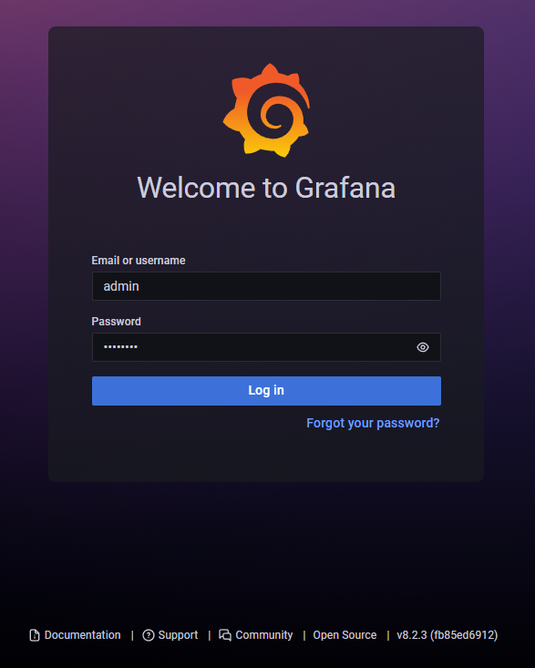
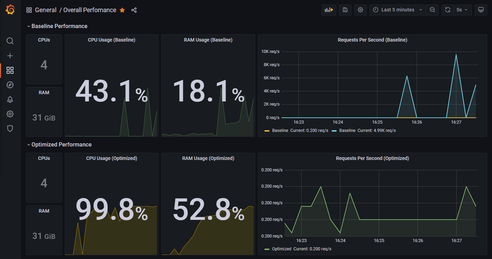
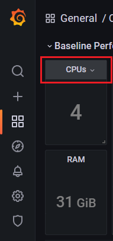
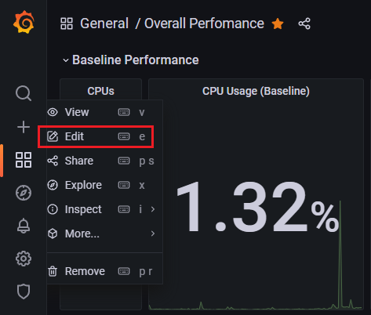
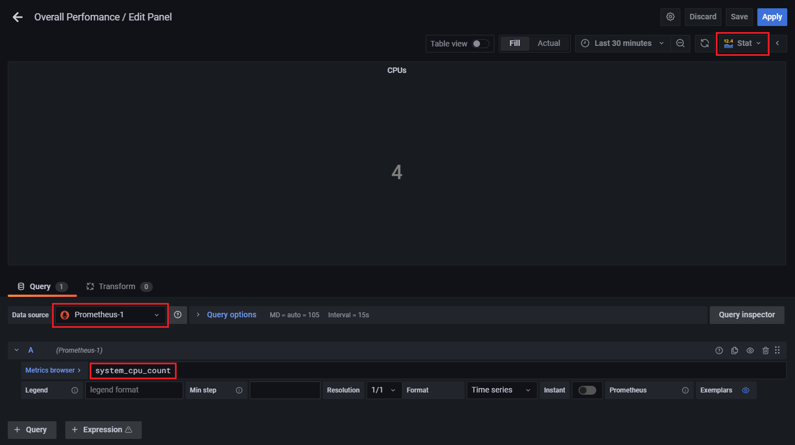
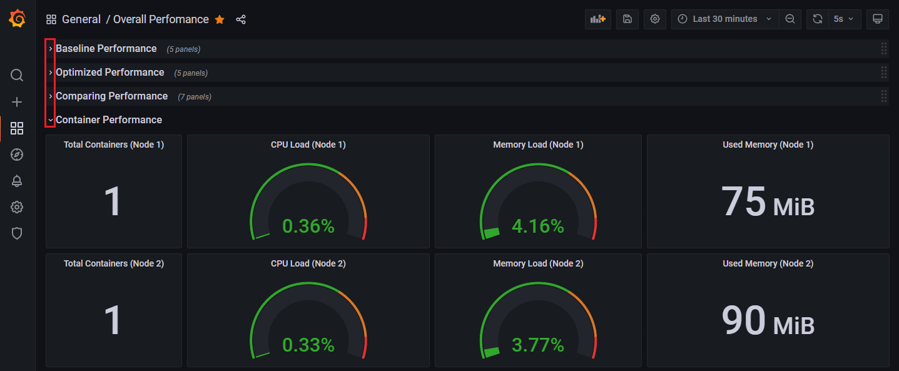

# Java Performance Comparison Dashboard Demo

#### OCI Demo Instances

The goal of this demo is to compare performance of Java applications running in a virtual environment or deployed in containers.  

There are two Oracle Linux 7.9 instances running in OCI, each with 2 CPUs (4 cores) and 32GB of RAM.  

* `graal-demo-01: 132.145.18.207`
* `graal-demo-02: 132.145.21.88`

One instance (`graal-demo-01`) is using the **Oracle JDK 17** runtime and the other instance (`graal-demo-02`) is using the **GraalVM EE 21.3.0 (JDK17)** runtime.

To access the systems:
```
$ ssh -i ~username/.ssh/ssh-key-graal-demo-1.key opc@132.145.18.207
```
or

```
$ ssh -i ~username/.ssh/ssh-key-graal-demo-2.key opc@132.145.21.88
```

> **NOTE:** You'll need to obtain the necessary key files to access the systems.

#### Starting the Demo App

A simple `primes` demo is provided (on both nodes) but other applications can be added.

To start the primes demo (on either host):

```
$ cd demo/primes
$ java -jar target/prime-0.0.1-SNAPSHOT.jar
```

#### Using Containers

```
$ docker run --rm --name primes-jdk -p 8080:8080 primes:jdk
```
```
$ docker run --rm --name primes-native -p 8080:8080 primes:native
```

> **NOTE:** 
> The `primes` demo has been compiled using Java 17.  Make certain you're using Java 17 (SDKMAN has been installed for your convenience). On **Node 1**, **Oracle JDK 17** is installed, on **Node 2**, **GraalVM 21.3.0** (JDK 17) is installed.
>```
> $ sdk current
>
> Using:
>
> gradle: 7.2
> java: 17.0.1-oracle  # <- On node 2: java: 21.3.0-17-ee
> maven: 3.8.3
> micronaut: 3.1.3
>
> $ java -version
> java version "17.0.1" 2021-10-19 LTS
> Java(TM) SE Runtime Environment (build 17.0.1+12-LTS-39)
> Java HotSpot(TM) 64-Bit Server VM (build 17.0.1+12-LTS-39, mixed mode, sharing)
>```

The `primes` demo produces data via `spring-actuator` (see source code) and is consumed by Prometheus. The app runs on port **8080**. Once started, you should begin to see data in the Grafana dashboard.

In addition, `hey` has been installed so that you can run benchmark tests. For example:

```
$ hey -n 1000000 --cpus=1 http://132.145.18.207:8080/primes
```

### Accessing the Prometheus Dashboard

You can access the Prometheus dashboard by browsing to: http://132.145.18.207:9090/ (Node 1) or http://132.145.21.88:9090/ (Node 2).


From here, you can execute queries and create graphs.  For example, you can begin typing `node_memory` in the search bar and Prometheus will display the available query options. Enter your query and press the **Execute** button.  In the example below, we're displaying the amount of free memory on the node (`node_memory_MemFree_bytes`):


You can also view which targets are available to provide metrics, from the Prometheus dashboard (http://132.145.18.207:9090/), click on **Status-> Targets**


You will see which targets are up and available:


> **NOTE:** The `spring-actuator` target will show an `UP` state when a demo application is running (otherwise it will show `Down`).

To learn more about Prometheus, see the docs [here](https://prometheus.io/docs/introduction/overview/).

### Accessing the Grafana Dashboard

To access the Grafana dashboard, browse to: http://132.145.18.207:3000/login



Credentials:

**Login:** admin

**Password:** Gr@@lVM!

By default, the **Overall Dashboard** will be displayed which includes a collection of metrics scraped from:

* Prometheus
* Node (system metrics)
* Cadvisor (containers)
* Spring-actuator (demo app)



Each metric displayed in the dashboard is considered a **panel**. All of the dashboard panels are customizable. 

For example, if you place your mouse over the top of the **CPUs** panel, an arrow will appear, clicking on the arrow will reveal a menu.  In that menu, choose **Edit**:





Choose your **data source**, enter a query in the **Metrics Browser** box, choose your **graph type** and click **Apply**.



Additionally, panels can be assembled in rows. Each row of graphs can be expanded/collapsed by clicking on the arrows for the corresponding rows:



To learn more about Grafana, see the docs [here](https://grafana.com/docs/).

If you are curious about the compute instance configuration, see **Compute Instance Configuration** document [here](ComputeConfiguration.md).